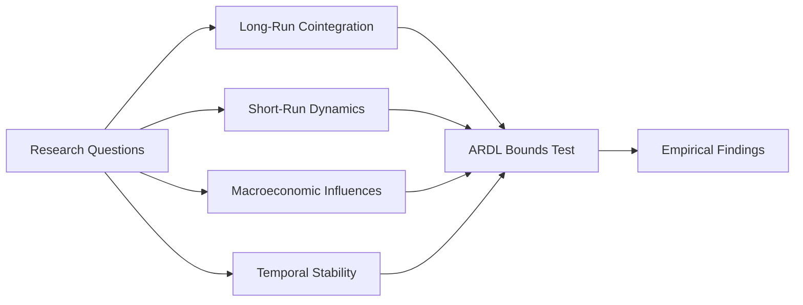
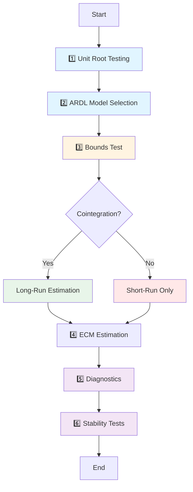

<div align="center">

#  Foreign Direct Investment and Economic Growth in Algeria

### An ARDL Bounds Testing Approach (1990–2023)

[](https://www.python.org/)
[](https://jupyter.org/)
[](https://opensource.org/licenses/MIT)
[]()

*An econometric investigation of FDI-growth dynamics in Algeria's hydrocarbon-dependent economy*

[📊 View Results](#-key-findings) • [🚀 Quick Start](#-quick-start) • [📖 Documentation](#-methodological-framework) • [👤 Author](#-author)

---

</div>

## 📑 Table of Contents

- [📌 Project Overview](#-project-overview)
- [🎯 Research Objectives](#-research-objectives)
- [🧠 Methodological Framework](#-methodological-framework)
- [📊 Data Description](#-data-description)
- [🧪 Econometric Procedure](#-econometric-procedure)
- [📈 Key Findings](#-key-findings)
- [🚀 Quick Start](#-quick-start)
- [🛠️ Technologies Used](#️-technologies-used)
- [📚 References](#-references)
- [👤 Author](#-author)
- [📜 License](#-license)

---

## 📌 Project Overview

<div align="center">
<table>
<tr>
<td width="50%">

### 🎓 **Academic Context**
Master's thesis project investigating the empirical relationship between FDI and economic growth in Algeria using advanced time series econometrics.

</td>
<td width="50%">

### 🔬 **Methodological Approach**
ARDL Bounds Testing framework enabling robust analysis of both short-run dynamics and long-run equilibrium relationships.

</td>
</tr>
</table>
</div>

This repository contains the **complete empirical implementation** of an econometric study examining the relationship between **Foreign Direct Investment (FDI)** and **economic growth** in Algeria using the **Autoregressive Distributed Lag (ARDL) Bounds Testing** framework.

The analysis investigates both **short-run dynamics** and **long-run equilibrium relationships** between FDI and GDP while accounting for key macroeconomic variables such as oil prices, trade openness, inflation, and gross capital formation.

> 💡 **Context:** The project is conducted in the context of Algeria's structural dependence on hydrocarbons and recurring exposure to external shocks, including the **COVID-19 pandemic**, which is explicitly modeled using a dummy variable.

---

## 🎯 Research Objectives

<div align="center">



</div>

The study seeks to answer the following questions:

| # | Research Question |
|---|-------------------|
| 1️⃣ | Does FDI exert a **long-run cointegrated effect** on Algeria's economic growth? |
| 2️⃣ | Are there **short-run dynamic effects** of FDI on GDP? |
| 3️⃣ | How do **oil prices**, **trade openness**, and **macroeconomic stability** influence growth? |
| 4️⃣ | Has the relationship between FDI and GDP remained **stable over time**? |

---

## 🧠 Methodological Framework

### Why ARDL?

<div align="center">

| ✨ Advantage | 📝 Description |
|--------------|----------------|
| 🔄 **Mixed Integration** | Accommodates variables integrated of order **I(0)** and **I(1)** |
| 📊 **Small Sample Performance** | Performs well with **limited observations** |
| ⚡ **Simultaneous Estimation** | Captures both short-run dynamics and long-run relationships |
| 🎯 **Spurious Regression Avoidance** | Robust specification when properly implemented |

</div>

> **⚠️ Important:** No variable integrated of order I(2) is included, ensuring full compliance with ARDL assumptions.

<details>
<summary><b>📖 Click to learn more about ARDL methodology</b></summary>

The ARDL Bounds Testing approach (Pesaran, Shin & Smith, 2001) involves:

1. **Unrestricted Error Correction Model (UECM)**
2. **F-statistic Bounds Test** for cointegration
3. **Long-run coefficient estimation** (if cointegrated)
4. **Error Correction Model (ECM)** for short-run dynamics
5. **Diagnostic testing** for model validity
6. **Stability analysis** using CUSUM/CUSUMSQ tests

</details>

---

## 📊 Data Description

<div align="center">

### 📅 Dataset Overview

| **Attribute** | **Details** |
|---------------|-------------|
| 🌍 **Country** | Algeria |
| 📆 **Period** | 1990–2023 (34 years) |
| 📈 **Frequency** | Annual |
| 🗂️ **Observations** | 34 |

</div>

### 🔢 Variables Used

<table>
<thead>
<tr>
<th width="25%">Variable</th>
<th width="50%">Description</th>
<th width="25%">Source</th>
</tr>
</thead>
<tbody>
<tr>
<td><code>log(Real GDP)</code></td>
<td>🏭 Measure of economic growth</td>
<td>World Bank WDI</td>
</tr>
<tr>
<td><code>FDI (% of GDP)</code></td>
<td>💰 Foreign direct investment inflows</td>
<td>World Bank WDI</td>
</tr>
<tr>
<td><code>Inflation</code></td>
<td>📊 CPI inflation rate</td>
<td>World Bank WDI</td>
</tr>
<tr>
<td><code>GCF (% of GDP)</code></td>
<td>🏗️ Gross capital formation</td>
<td>World Bank WDI</td>
</tr>
<tr>
<td><code>Trade Openness</code></td>
<td>🌐 (Exports + Imports) / GDP</td>
<td>World Bank WDI</td>
</tr>
<tr>
<td><code>log(Oil Price)</code></td>
<td>🛢️ International crude oil price</td>
<td>FRED (POILBREUSD)</td>
</tr>
<tr>
<td><code>D2020</code></td>
<td>🦠 COVID-19 dummy variable</td>
<td>Constructed</td>
</tr>
</tbody>
</table>

**📚 Data Sources:** [World Bank WDI](https://databank.worldbank.org/) • [Macrotrends](https://www.macrotrends.net/) • [FRED](https://fred.stlouisfed.org/)

---

## 🧪 Econometric Procedure

<div align="center">



</div>

### Detailed Steps

<table>
<tr>
<td width="5%">1️⃣</td>
<td width="30%"><b>Unit Root Testing</b></td>
<td>
• Augmented Dickey–Fuller (ADF)<br>
• Constant and trend specifications<br>
• AIC-based lag selection
</td>
</tr>
<tr>
<td>2️⃣</td>
<td><b>ARDL Model Selection</b></td>
<td>
• Maximum lag length = 2<br>
• Optimal specification via AIC<br>
• Model parsimony principle
</td>
</tr>
<tr>
<td>3️⃣</td>
<td><b>Bounds Test</b></td>
<td>
• F-statistic computation<br>
• Critical values comparison<br>
• Cointegration decision
</td>
</tr>
<tr>
<td>4️⃣</td>
<td><b>Short-Run Dynamics</b></td>
<td>
• Error Correction Model (ECM)<br>
• Lagged effects interpretation<br>
• COVID-19 shock control
</td>
</tr>
<tr>
<td>5️⃣</td>
<td><b>Model Diagnostics</b></td>
<td>
• Serial correlation (Breusch-Godfrey)<br>
• Heteroskedasticity (White)<br>
• Normality (Jarque-Bera)
</td>
</tr>
<tr>
<td>6️⃣</td>
<td><b>Stability Analysis</b></td>
<td>
• CUSUM test<br>
• CUSUM of Squares test<br>
• Recursive estimation
</td>
</tr>
</table>

---

## 📈 Key Findings

<div align="center">

### 🎯 Summary of Results

</div>

<table>
<tr>
<td width="50%" valign="top">

### 🔹 Long-Run Relationship

```diff
- ❌ No Evidence of Cointegration
```

**Key Finding:**
- FDI does **not** drive sustained long-run growth in Algeria (1990–2023)
- F-statistic below critical bounds
- No long-run equilibrium relationship detected

**Interpretation:**
Algeria's FDI has failed to create lasting productive capacity or technological spillovers necessary for sustained economic expansion.

</td>
<td width="50%" valign="top">

### 🔹 Short-Run Dynamics

```diff
! ⚠️ Weak and Unstable Effects
```

**Key Findings:**
- ❌ FDI effects: **weak, unstable**, marginally significant
- ✅ **Oil prices**: strong positive effect (delayed)
- ⚠️ **Trade openness**: negative lagged effects
- 🦠 **COVID-19**: significant GDP contraction

**Interpretation:**
Short-term FDI contributions are negligible compared to oil price movements.

</td>
</tr>
</table>

### 🏛️ Structural Insights

<div align="center">

| 🎯 Characteristic | 📊 Finding |
|-------------------|------------|
| 🛢️ **Hydrocarbon Dependence** | Economy remains highly dependent on oil revenues |
| 💥 **External Vulnerability** | Significant exposure to external shocks |
| 🔄 **FDI Absorption Capacity** | Limited ability to transform FDI into durable growth |
| 🏗️ **Structural Reforms** | Need for economic diversification and institutional improvements |

</div>

> 💡 **Policy Implication:** Algeria must address structural barriers and improve the business environment to better leverage FDI for sustainable growth.

---

## 🚀 Quick Start

### Prerequisites

- Python 3.8 or higher
- Git

---

## 🛠️ Technologies Used

<div align="center">

### Core Stack

[](https://www.python.org/)
[](https://jupyter.org/)
[](https://numpy.org/)
[](https://pandas.pydata.org/)

### Econometric & Statistical

| Package | Purpose |
|---------|---------|
| `statsmodels` | 📊 Econometric modeling (ARDL, ADF, diagnostics) |
| `arch` | 📈 ARCH/GARCH models |
| `scipy` | 🔬 Statistical tests |

### Visualization

| Package | Purpose |
|---------|---------|
| `matplotlib` | 📊 Static plots and charts |
| `seaborn` | 🎨 Statistical data visualization |
| `plotly` | 📈 Interactive visualizations |

</div>

---

## 📚 References

<details open>
<summary><b>📖 Key Literature</b></summary>

1. **Pesaran, M. H., Shin, Y., & Smith, R. J.** (2001). *Bounds testing approaches to the analysis of level relationships*. Journal of Applied Econometrics, 16(3), 289-326.  
   🔗 [DOI: 10.1002/jae.616](https://doi.org/10.1002/jae.616)

2. **Dickey, D. A., & Fuller, W. A.** (1979). *Distribution of the estimators for autoregressive time series with a unit root*. Journal of the American Statistical Association, 74(366a), 427-431.  
   🔗 [DOI: 10.2307/2286348](https://doi.org/10.2307/2286348)

3. **Gujarati, D. N., & Porter, D. C.** (2009). *Basic Econometrics* (5th ed.). McGraw-Hill Education.

4. **Louail, B., Benanaya, D., & Bakdi, A.** (2017). Foreign Direct Investment and Economic Growth in Algeria. *International Journal of Economics and Finance*, 9(4).

5. **World Bank** – World Development Indicators (WDI)  
   🔗 [https://databank.worldbank.org/](https://databank.worldbank.org/)

</details>

---

## 👤 Author

<div align="center">


### **Amrani Bouabdellah**

Master's Student – Statistics & Data Science  
📍 ENSSEA (École Nationale Supérieure de Statistique et d'Économie Appliquée)  
📍 Algiers, Algeria

[](mailto:abdouugk@gmail.com)
[](https://github.com/amrani-213)

</div>

---

## 📜 License

<div align="center">

This project is licensed under the **MIT License**

See the [LICENSE](LICENSE) file for details

[](https://opensource.org/licenses/MIT)

</div>

---

## 🙏 Acknowledgments

<div align="center">

Special thanks to:

🌍 **World Bank** for open data availability  
💻 **Open-source community** for econometric tools  
📚 **Research community** for methodological foundations

</div>

---


<div align="center">

### ⭐ **Star this repository if you find it useful!**

[](https://github.com/AmraniBoubdellah/FDI-Algeria-ARDL/stargazers)
[](https://github.com/AmraniBoubdellah/FDI-Algeria-ARDL/network/members)


[⬆ Back to Top](#-foreign-direct-investment-and-economic-growth-in-algeria)

</div>
